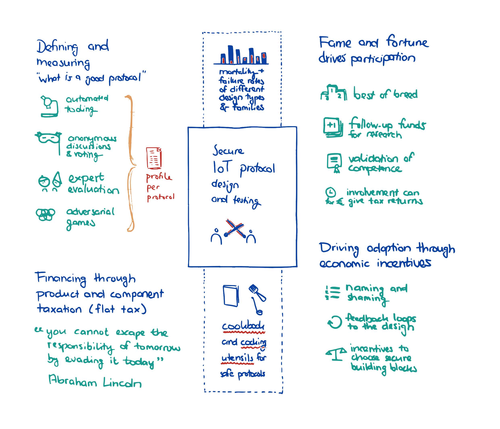

# Making and breaking IoT protocol development and evaluation processes

An exploration into the influence of competition structure on the assurance provided by an adversarial process. Participants will propose competition blueprints and identify problems related to incentives (mis)alignment, exploring how to shape the dynamics of adversarial engineering design competitions such that they incentivise and align security engineering and assurance efforts in the IoT domain.

## Project description

The precise project description, including the format and detailed content, will be determined based on input gathered before the start of the hackathon to ensure that it aligns with the interest of potential participants. Key aspects of the hackathon structure that have already been defined are having both a 'making' part and a 'breaking' part (possibly with multiple rounds, the ability to 'tweak' process blueprints, and the selection/shortlisting of specific solution directions for further focus).

## What problem are you trying to solve?

Current, many IoT devices provide no or limited security guarantees. As a result of the EU's Radio Equipment Directive delegated acts, newly marketed IoT devices are expected to achieve a baseline level of security over the coming years. While some of the relevant security controls such as the absence of default passwords are self-explanatory and relatively simple to implement, this is far from the case for the protocol security. Both of these aspects are much harder when it comes to the security properties of IoT (application-layer) protocols. Even so, cryptographic protocols -- even algorithms -- have traditionally been designed in-house. Once reverse engineered, they have often turned out to be weak. Continued archaeology of weak designs from years-gone-by shows that in-house black-box design doesn't provide the assurance that IoT protocols need. A common alternative approach has its own drawbacks: design by committee tends to lead to complex designs that lack coherence and conceptual integrity, among others driven by politics and vested interests such as patents.

## How are you planning to use the hackathon to find solutions?

Unlike classical hackathons, which result in (designs for) hardware and/or software, the intended output of this hackathon is a collection of process blueprints that may exemplify patterns and anti-patterns for adversarial engineering design competitions, with an emphasis on (the alignment of) incentives for assured technology transfer from theory to practice. These blueprints can serve as inspiration for competitions organisers looking to set up a process for IoT protocol development and evaluation, providing assurance through incentives design that has been vetted through the lens of security economics.

## Looking for

- Security economists
- Current and former competition organisers
- IoT domain experts
- Standards development organisations
- Embedded systems evaluators
- Protocol designers
- Cryptographers and cryptanalysts
- Usable security researchers
- Developers of verification tools
- Library maintainers
- Product security specialists
- Policy makers
- (this is a non-exhaustive list)

## Outcome

